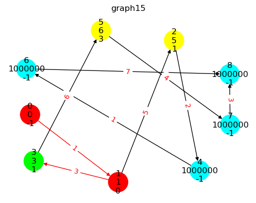

# How it works

#### This programm makes a set of images that describes graph state in each algorithm step

## Example of generated graph state:

 

### Label in the top is the name of the file

### node colors:
-  red    - passed
-  green  - current
-  yellow - neighbours of passed and current nodes

### edges colors:
-  red   - passed
-  black - other
### red edges define the optimal route tree

### Edge number: 
- weight
### Node numbers (from top to bottom):
- node number
- node weight (maximum edge's weight for edges in optimal root). default: 1000000
- previous node. default: -1
#### default means there isn't any optimal roots at this moment

# How to use it

#### Make your own graph like in example in `main.py`
#### To start  
